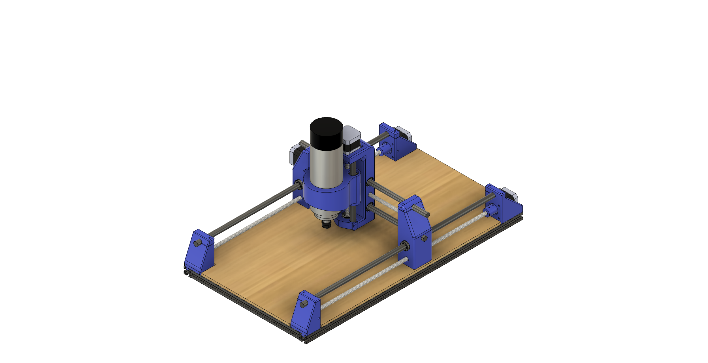
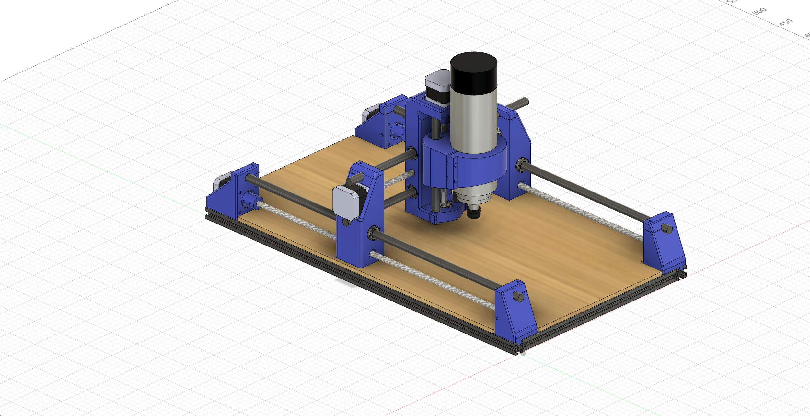
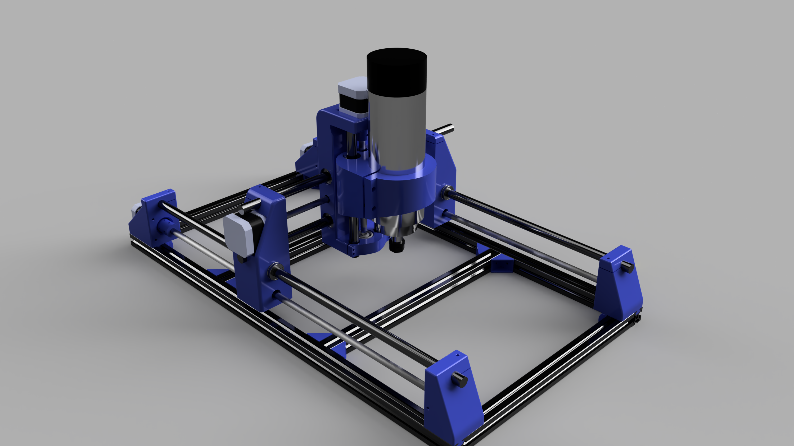

# 3D_Printed_CNC_Mill
3-axis CNC Mill designed in Fusion 360 using budget and custom 3D printed components
# Overview
This project was undertaken as a challenge to improve skills in mechanical design using CAD and mechatronics integration with Arduino and GRBL.
The mill was designed for machining metal, wood and acrylic in 3 dimensions using a 1.5kW spindle. These documents highlight its design, assembly and manufacture.

# Photos
Isometric Views:

Rendered View:

# Parts
To Order:
* Aluminium Profiles (20mmx20mm)
  * 2x600mm, 2x300mm
* Smooth, steel rods (12mm diameter)
  * 2x550mm, 2x350mm, 2x175mm
* Threaded steel rods
  * 2x500mm, 1x270mm, 1x149mm
* 608 bearings
  * 4x
* Linear bearings (LM12UU)
  * 12x
* Stepper motors
  * 4x
* Bolts
* 28xM3, 2xM6, 8xT-nuts 
* Spindle motor (Vevor air-cooled, 1.5kW)

3D Printed (see STL files):
* Frame supports
  * 8x
* X-Carriage left
* X-Carriage right
* Y-Carriage
* Z-Carriage
* Couplers
  * 4x
* Motor holder left
* Motor holder right
* Rod holder left
* Rod holder right

# Future Steps
* Print/Order components
* Assemble Frame
* Electronics Assembly
* Programming (Arduino)
* GRBL integration
* Testing!
